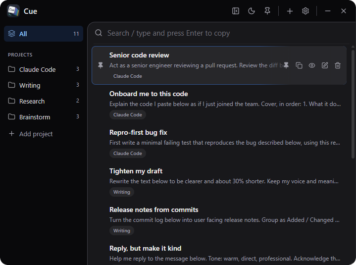

<p align="center">
  
</p>

<h1 align="center">Cue</h1>

---

<p align="center">
  Save AI prompts, search them, and reuse them instantly.
</p>

<p align="center">
  <a href="./LICENSE">
    
  </a>
  
  
  
  
  
</p>

<p align="center">
  <b>English</b> · <a href="./README.ja.md">日本語</a>
</p>

<p align="center">
  
</p>

Cue is a desktop app for saving and reusing the prompts you send to AI tools like Claude Code, Codex, and ChatGPT. Save a prompt with a hotkey, search for it later, and click it to copy.

Works on Windows, macOS, and Linux.

## Features

- **Launcher**: Open with a global hotkey, search, and click an item to copy it.
- **Projects**: Group prompts, with an "All" view across them.
- **Markdown**: Each prompt supports Markdown, and you can switch between editing and preview.
- **Organize**: Search, pin, drag to reorder, and a context menu (rename, copy, preview, edit, pin, delete).
- **Always on top**: Keep the window above other apps.
- **Backup and sync**: Export and import all data as one JSON file, or sync to a private Git repository you own.
- **Themes and languages**: Light and dark themes, accent colors, text size, and 14 languages.
- **Local storage**: Data is kept in a local SQLite file. Nothing is sent anywhere unless you set up Git sync.

## Keyboard shortcuts

| Action | Default |
|---|---|
| Show / hide (global) | `Ctrl/⌘ + Shift + Space` |
| Save clipboard as new item (global) | `Ctrl/⌘ + Shift + S` |
| Move selection | `↑` / `↓` |
| Copy selected | `Enter` |
| New item | `Ctrl/⌘ + N` |
| Focus search | `Ctrl/⌘ + F` |
| Clear search | `Esc` |
| Save (in editor) | `Ctrl/⌘ + Enter` |

The two global shortcuts are configurable in Settings.

## Install

Prebuilt installers are available on the [Releases](../../releases) page.

## Development

Prerequisites: [Node.js](https://nodejs.org), [pnpm](https://pnpm.io), [Rust](https://www.rust-lang.org), and your platform's [Tauri prerequisites](https://v2.tauri.app/start/prerequisites/).

```bash
pnpm install        # install dependencies
pnpm tauri dev      # run in development
pnpm tauri build    # build release installers
pnpm build          # frontend type-check + build only (tsc && vite build)
```

## Tech stack

- **Tauri v2** (Rust backend)
- **React 19 + Vite + TypeScript**
- **Tailwind CSS v4**, **lucide-react** icons, **zustand** state
- **SQLite** via `tauri-plugin-sql`
- Plugins: `global-shortcut`, `clipboard-manager`, `autostart`, `single-instance`, `dialog`, `window-state`

## Project layout

```
src/                  Frontend (React)
  components/         Header, Sidebar, SearchBar, ItemList/ItemRow, Editor, Settings, ContextMenu, Dropdown, Toaster
  lib/                db.ts (SQLite), tauri.ts, i18n.ts, search.ts, markdown.ts, drag.ts, platform.ts
  store.ts            zustand store (state + all actions)
  types.ts
src-tauri/
  src/lib.rs          tray / global hotkeys / window control / SQL migrations / git sync
  tauri.conf.json     window (frameless) + plugin config
  capabilities/       permissions
```

## Data & privacy

Your data is stored in a local SQLite database (`cue.db`) under the OS app data directory, for example `%APPDATA%\com.cue.app` on Windows. Cue does not make any network calls on its own. If you turn on Git sync, it pushes only to the private repository URL you provide, using your own git credentials.

## Contributing

Contributions are welcome — see [CONTRIBUTING.md](./CONTRIBUTING.md).

## License

[MIT](./LICENSE)
